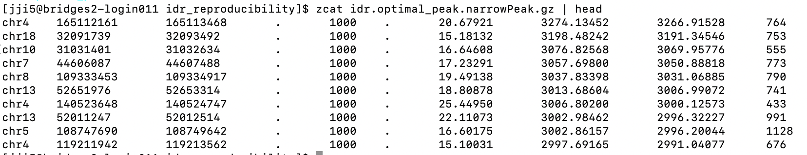

### Access the Bridges-2 server

```bash
    ssh yourusername@bridges2.psc.edu
```

Then enter password for your bridges-2 account. You won't be able to see the password when you type. 

### Find data storing folder.
```bash
    cd /ocean/projects/bio230007p/ikaplow/HumanAtac/Pancreas/peak
```
There are many subfolders inside. For now we should use idr_reproducibility
```bash
    cd idr_reproducibility
```
To look at the data structure of one of the files, we can do
```bash
    zcat idr.optimal_peak.narrowPeak.gz | head
```


### What each column means?

1. chrom
- Chromosome name.
2. chromStart
- Start coordinate of the peak region, 0-based.
3. chromEnd
- End coordinate of the peak region.
4. name
    Peak identifier. 
    In the file it is just . meaning no custom peak name was assigned.
5. score
- Integer score from 0 to 1000 for display purposes.
- In the file it is 1000 for these peaks, which usually means the values were capped at the maximum browser score.
6. strand
- For ATAC-seq this is usually . because peaks are not strand-specific.
7. signalValue
- Peak enrichment / intensity measure.
- Bigger usually means a stronger ATAC signal.
8. pValue
- Statistical significance of the peak, usually stored as -log10(p-value).
- Bigger means more significant.
9. qValue
- Multiple-testing-adjusted significance, usually -log10(q-value).
- Bigger means more significant after correction.
10. peak
- Position of the summit relative to chromStart.
